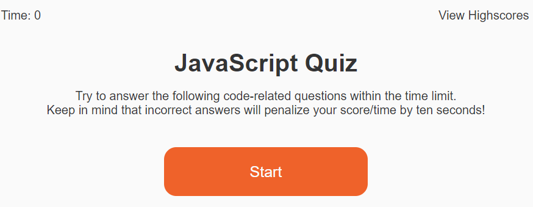
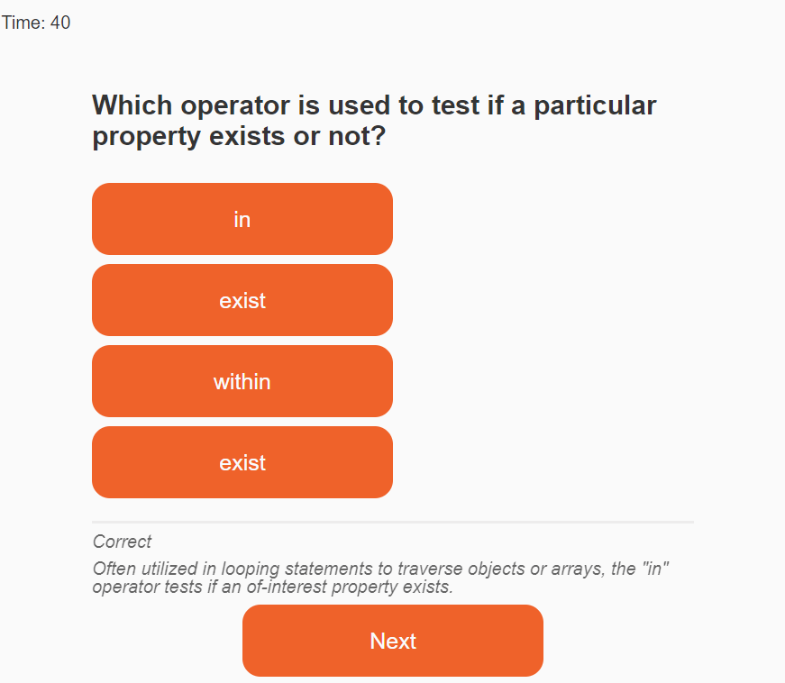
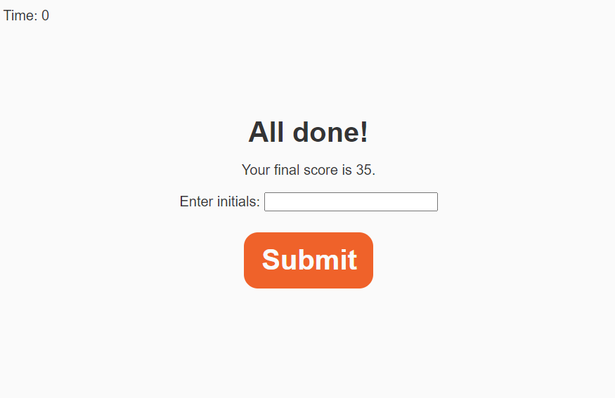
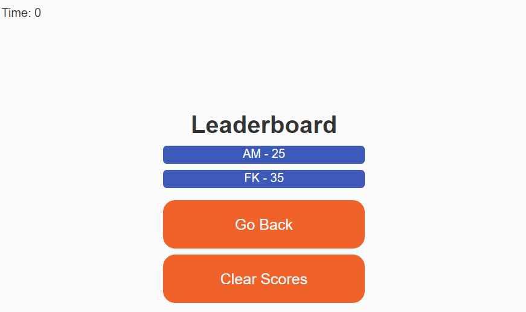

# code-quiz

## Description
This website was created Florian Kreuk as part of the UCONN Coding Bootcamp module 4. The purpose of this website is to generate a timed coding quiz for users to test their knowledge of JS. The website will store the user's scores in local storage.

The following image demonstrates the web application's appearence:

Below is the landing page:

Upon selecting Start, you are presented with a random question from the set and the timer starts counting:

Upon the timer running out or the user's compeletion of questions, the all done screen appears and allows the user to add their score to the leaderboard:

The user can clear the leaderboard or navigate back to the landing page to try the quiz again:

The following link takes you to the deployed application: [link](https://f-kreuk.github.io/code-quiz/)

## Installation
N/A

## Usage
To use this website, simply select Start and select the best answer to each questions. After selecting each answer, hit Next to navigate to the next question. At the conclusion of the test, enter your initials and select submit to post your score to the leaderboard.

## Credits
For the css reset, I utilized the sample provided in 28-Stu_Mini-Project through the UCONN coding bootcamp.

I utilized the following YouTube tutorial as the primary guide to this exercise:
https://www.youtube.com/watch?app=desktop&v=riDzcEQbX6k

I utilized the following forum to add text before or after an HTML element (add correct/incorrect to helptext):
https://stackoverflow.com/questions/7378097/add-text-before-or-after-an-html-element

I utilized the following tutorial for sorting my leaderboard:
https://www.w3schools.com/jsref/jsref_sort.asp

I utilzied the following resource for updating text in span tag:
https://www.geeksforgeeks.org/javascript-change-the-text-of-a-span-element/

## License
Please refer to the LICENSE in repo.